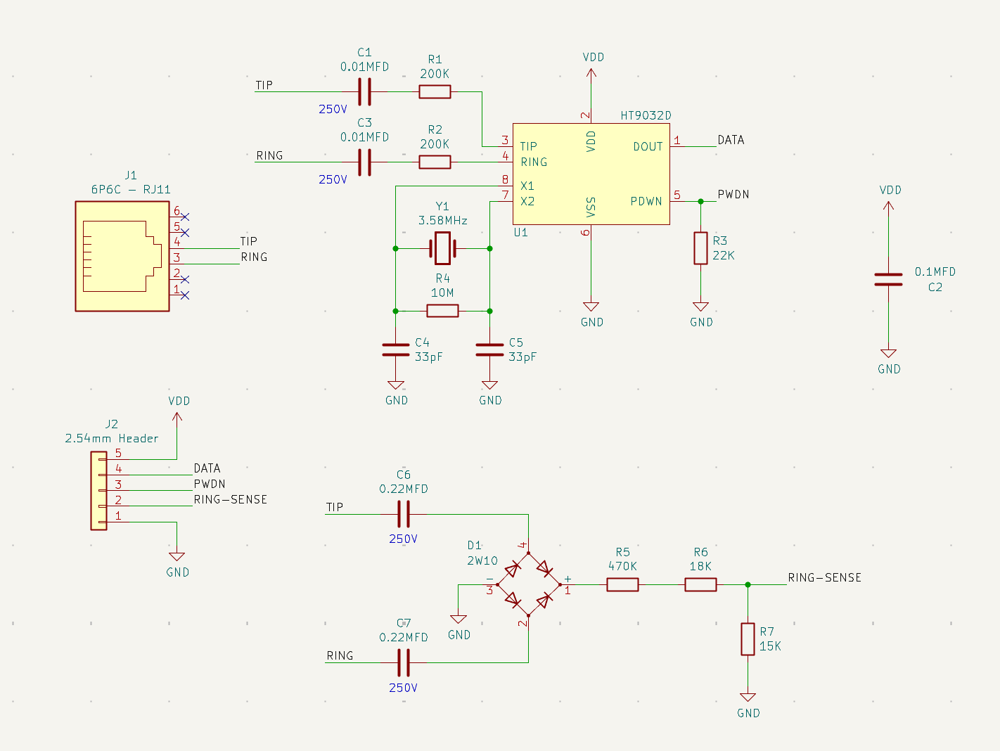
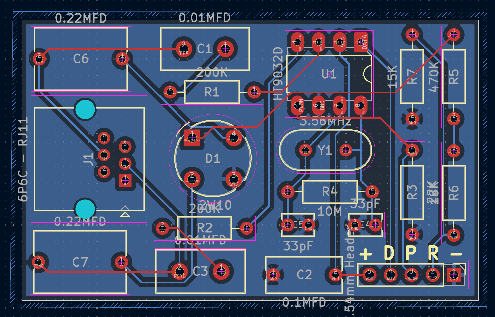
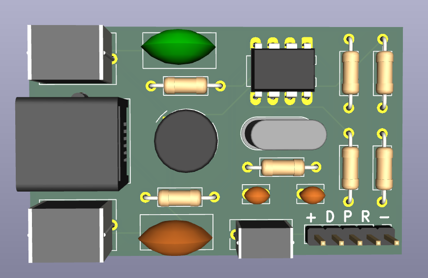

# Caller ID

Caller ID module that can be used in various projects, providing reliable identification of incoming calls along with essential details such as phone numbers, timestamps, and optional contact name resolution. This module ([origin](https://github.com/dilshan/arduino-caller-id)) is designed and modified to be easily integrated into different systems.

## Scheme

Board | Preview 
-----|-----
|

## Sponsorship

**Huge thanks to [PCBWay](https://pcbway.com) for sponsoring this project!**

PCBWay is a go-to solution for anyone looking to create high-quality PCBs—whether you're a DIY enthusiast, a student, or a professional engineer.

They offer a wide range of services, including:

- Fast and reliable PCB prototyping
- Full assembly services
- Instant online quotes
- Quality checks by experienced engineers
- A smooth and straightforward ordering process

Thanks again to PCBWay for supporting this build and helping bring it to life!
